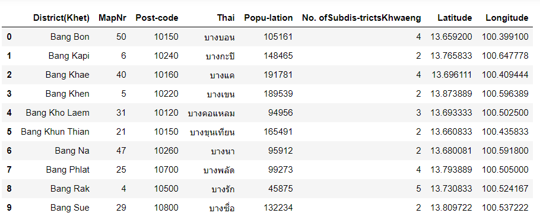

# Bangkok :  the district of food

# Introduction

Bangkok is one of the most exciting cities in the world especially if you are a food lover. Bangkok is very famous on food. People always have a hard time when they have to determine what to eat.

In this project, we will provide a dining and restaurant guide for people who plans to travel to Bangkok or even the local people by recommending the top 10 type of restaurant in each district. In addition, this project may useful for a stakeholder who wants to open a restaurant in Bangkok.

Thai style food

## Data Sets and APIs

- Bangkok District location data

    We will use the table provide in [https://en.wikipedia.org/wiki/List_of_districts_of_Bangkok](https://en.wikipedia.org/wiki/List_of_districts_of_Bangkok) by scraping the website with package Beautiful soup.

- Foursquare API

    This project would use Four-square API as its data gathering source to obtained the venue and restaurant information. Foursquare is a location-based online social network, and Foursquare Places API offers real-time access to its global database for developers to explore the attributes of commercial venues.

## Methodology

### Data collection

1. Bangkok District location data

    We use python package Beautiful soup to collect the table data of Bangkok district location from [https://en.wikipedia.org/wiki/List_of_districts_of_Bangkok](https://en.wikipedia.org/wiki/List_of_districts_of_Bangkok)

    The data that we obtains consists of 50 rows and 8 columns

    

    The first 10 rows of geolocation 50 district in Bangkok

    For the propose of analysis of this project, we drop the irrelevant columns such as MapNr,Post-code and rename the other for meaningful names. We present the first 5 row here

    

    There are 5 columns

    - District - the name of district
    - Population - number of population for each district
    - num_subdistrict - number of subdistrict
    - Latitude - Latitude of the district
    - Longitude - Longitude of the district

    We use scatter plot to find some relationship between number of population and number of subdistrict but we found that there is not correlated

    

    Now we put the data of coordinate to the map using the package folium to visualize the location.

    

    map of district of Bangkok using folium

    We done the exploration of our first data. We will introduce you another source of data Foursquare API

2. Foursquare API

    We want to gather the location of restaurant nearby the district location. We use the Foursquare API to query the top 100 nearby each district with a radius of 2000 meters. In this project we interested only the category of food venue which has **categoryId = 4d4b7105d754a06374d8125** [https://developer.foursquare.com/docs/build-with-foursquare/categories](https://developer.foursquare.com/docs/build-with-foursquare/categories)

    Here is the example of dataframe after called API from foursquares, we found 4118 food venue near by which has 82 unique sub categories

    

### Methodology

- K-Means Clustering

This project applies K-mean clustering unsupervised machine learning algorithm to cluster the district based on the type of food venue such as Noodle House, Thai Restaurant, Café. This would give a better understanding of the similarities and dissimilarities between the chosen neighborhoods to retrieve more insights and to conclude with ease which neighborhood wins over other. 

In this project, we use k=5 is the number of cluster. We applied K-means clustering to data based on 10 most common food venue for each district then we put it to map again for visualize propose.

## Results

We got 5 cluster based on K-means clustering of 10 most common food venue. Let's explore for each cluster

- Cluster 0 : Red

    

    Considering Cluster 0, the 1-5 common venue consists of Noodle house, Thai restaurant and found many of western restaurant. 

- Cluster 1 : Purple

    

    Considering Cluster 1, the pattern is solid than the cluster 0 mainly common with Noodle House, Thai Restaurant, Café follow by Asian restaurant. 

- Cluster 2 :  Sky blue

    

    Considering Cluster 2, the 1st most common venue for this cluster is Thai restaurants followed by Noodle or Asian restaurant and found a lot of  

- Cluster 3 : Light green

    

    Considering Cluster 3, the biggest cluster : the top two most common venue for this cluster are Thai restaurants or Noodle or Asian restaurant and most has cafe in common

- Cluster 4 : Orange

    

    Considering Cluster 3, the first common venue for this cluster is Noodle followed by Thai or Chinese restaurants and has some Japanese or seafood in common

## Discussion

In this study, we found that the population can vary with no correlated of number of subdrictrict. Different approaches of exploratory analysis are applied to find insights of the data. We apply K-means clustering when k=5 to cluster and visualizing the locations of each venue cluster, labeled by different colors for different clusters. Moreover, tables demonstrating the neighborhoods and its most common venues in each cluster are also included in the report. We found that it is hard to distinguish each cluster. It might due to there are many type of the restaurant which some is vary similar. For better solution in the next study, grouping the similar of restaurant type would benefit. 

## Conclusion

As we found in this research, there are many kind of restaurant throgh Bangkok. People can apply the findings to see the most common restaurant type in each neighborhood. The findings are valuable for both visitors and business persons. The visitors can see the findings in order to find where to visit in each area. Business persons can find the gap to open their business in the neighborhood.

## References

[https://en.wikipedia.org/wiki/List_of_districts_of_Bangkok](https://en.wikipedia.org/wiki/List_of_districts_of_Bangkok)

[https://developer.foursquare.com/docs/places-api/](https://developer.foursquare.com/docs/places-api/)